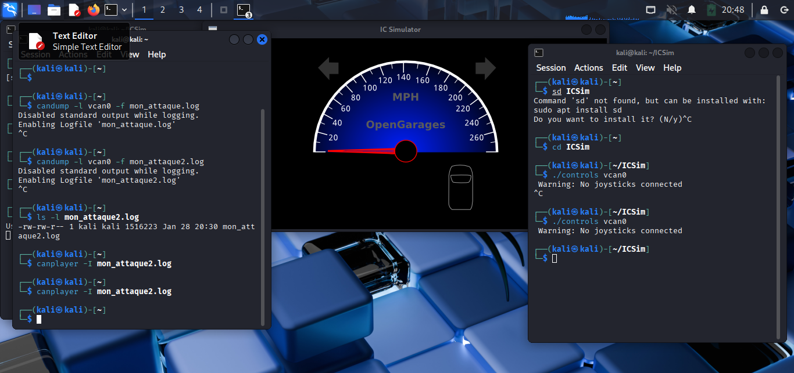

# 📻 CAN Bus Replay Attack

Ce projet démontre comment intercepter et rejouer des paquets CAN pour contrôler un véhicule sans accès au code source.

## 📸 Preuve de Concept (PoC)
Voici le terminal exécutant l'attaque à côté du tableau de bord ciblé :

## ⚙️ Méthodologie

### 1. Interception (Sniffing)
Utilisation de `candump` pour écouter le bus `vcan0` et capturer le signal d'accélération et de clignotant.

candump -l vcan0 -f mon_attaque2.log

#### 2. Attaque (Replay)
Réinjection du fichier log brut avec canplayer.
Ici comme le bus CAN ne possédant pas de mécanisme d'authentification par défaut, la voiture exécute l'ordre comme si l'action venait du conducteur .
La commande utilisée : canplayer -I mon_attaque2.log  ,
mon_attaque_2.log est le nom du fichier enregistré c'est à dire le comportement enregistré quant j'utilisais la mannette.

🛠️ Outils utilisés

Kali Linux

can-utils (candump, canplayer)

ICSim (Instrument Cluster Simulator)
